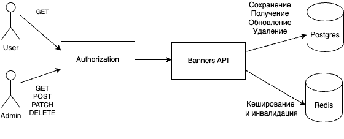

# Avito Test Assignment Banners REST

make цели: \
- run\
    Требует установненного Docker. 
    Поднимает 3 контейнера Postgres:latest, Redis:latest, BannersApi и запускает сервис. Настройки портов для приложелния находятся в файле configs/config.yml

- build \
    Требует установленного Go. Собирает приложение в бинарный файл.

- test \
    Требует установленного Go. Поднимает 2 контейнера Postgres:latest, Redis:latest и запускает E2E тестирование. Настройки портов для приложелния находятся в файле tests/configs/config.yml

- cover \
    Запускает покрытие кода тестами.

- gen \
    Генерирует моки для сервиса

## Content

1. [Authorization](#Authorization) \
    1.1 [Handlers](#Handlers) 
2. [Banners API](#Banners API) \
    2.1 [Handlers](#Handlers)

# Authorization

## Handlers
1. POST: /auth/sign-up \
    Регистрация пользователя и администратора. Сохраняет в базу данных логин, пароль, роль (user/admin).
2. POST: /auth/sign-in \
    Аутентификация. При успешной авторизации возвращает JWT Token.

# Banners API

## Handlers
1. GET: /api/v1/banners \
    Доступ: admin. Получение всех баннеров с фильтрацией по фиче и тегу и параметрам limit, offset.
    Кеширует баннер в редисе.
2. POST: /api/v1/banners \
   Доступ: admin. Создание нового банера.
3. DELETE: /api/v1/banners/{id} \
   Доступ: admin. Удаление баннера по id.
4. PATCH: /api/v1/banners/{id} \
   Доступ: admin. Обновление баннера по id.
5. GET: /api/v1/user_banner \
   Доступ: admin, user. Получение баннера по фиче и тегу. В случае переданного флага use_last_revision обращается на прямую в БД, иначе сначала смотрит в редис
6. GET: /swagger/index.html \
    Доступ: Все. swagger документация API
